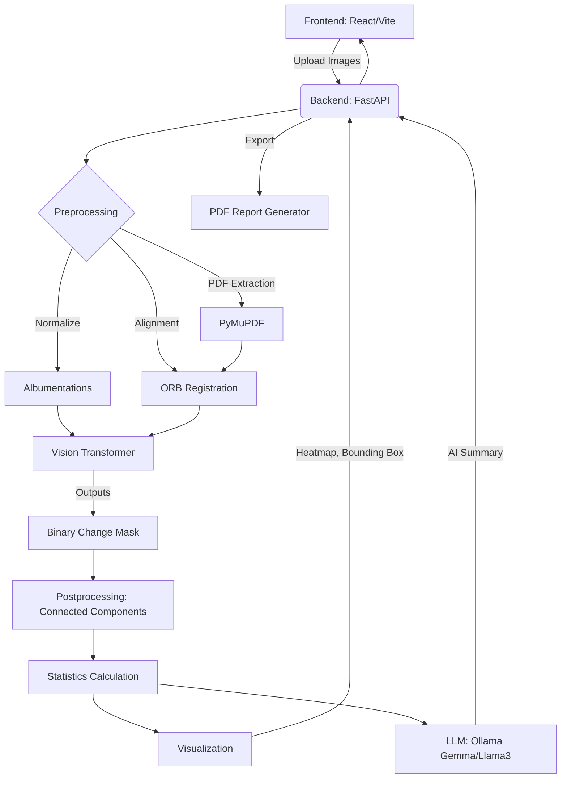

# AI-Based Image Difference Detection, Visualization, and Automated Change Summarization

A production-quality AI application designed for industrial inspection, capable of comparing two versions of an image or PDF, detecting visual differences using a Vision Transformer, and generating an AI-powered natural language summary.

## System Architecture



## Features
- **Upload**: Support for JPG, PNG, and PDF files.
- **Preprocessing**: Automatic resizing, normalization, and feature-based image registration (ORB).
- **Vision Transformer Engine**: Built to run ViT-based architectures (ChangeFormer, TinyCD) for semantic change detection.
- **Visualization**: Interactive Before/After slider, Heatmaps, Overlay Masks, Bounding Boxes.
- **Statistics**: Calculates area, severity, confidence, and location of changes.
- **AI Summary**: Generates a natural language summary of the changes using local LLMs via Ollama.
- **Export**: Downloadable PDF reports containing the visualizations and AI summary.

## Folder Structure
```
├── backend/
│   ├── app/
│   │   ├── api/          # FastAPI Routes
│   │   ├── core/         # Config & Database Setup
│   │   ├── detection/    # Vision Transformer & Inference
│   │   ├── models/       # Pydantic schemas & SQLAlchemy models
│   │   ├── postprocessing/ # Components, Stats, Visualization
│   │   ├── preprocessing/  # Resizing, PDF parsing, Registration
│   │   ├── reports/      # PDF Report Generator
│   │   └── summary/      # LLM Integration via Ollama
│   ├── checkpoints/      # Pretrained weights for Vision Model
│   └── main.py           # Entrypoint
├── frontend/
│   ├── src/
│   │   ├── api/          # Axios client
│   │   ├── components/   # React Components
│   │   └── pages/        # Views (Home, Results)
│   └── package.json
```

## How the AI Works
1. **Vision Transformer (Change Detection)**: 
   The application uses a Siamese Vision Transformer architecture. Both images are processed through a ViT backbone (via `timm`) to extract deep semantic features. The absolute difference between these features is calculated and decoded into a binary change mask indicating structural changes, ignoring minor noise and lighting variations.
2. **LLM Summary**:
   The detected regions are processed using Connected Components to extract statistics (area, severity, bounding boxes). These statistics are formatted into structured JSON and sent to a local Large Language Model (like Llama 3 via Ollama). The LLM is prompted to translate this data into a professional, concise technical summary describing the modifications.

## Installation & Running Locally

### Requirements
- Python 3.12+
- Node.js 20+
- Ollama (running locally with `llama3` or `gemma` pulled)

### Backend
```bash
cd backend
python -m venv venv
source venv/bin/activate  # or venv\Scripts\activate on Windows
pip install -r requirements.txt
uvicorn app.main:app --reload
```

### Frontend
```bash
cd frontend
npm install
npm run dev
```


## API Documentation
Once the backend is running, the Swagger API documentation is available at:
`http://localhost:8000/docs`

## Future Improvements
- **Batch Processing**: Allow uploading zip files containing multiple pairs.
- **Interactive Heatmap**: Click on regions on the frontend to highlight specific stats.
- **Advanced Registration**: Implement deep-learning based homography estimation for extreme perspective changes.
